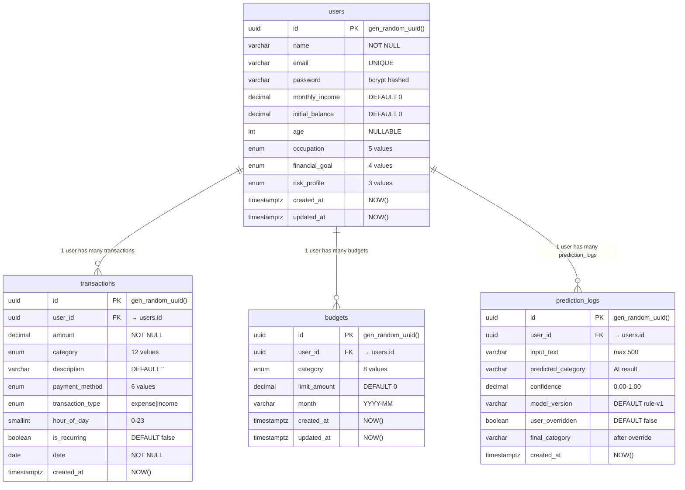

# 📊 ERD (Entity Relationship Diagram) — FinZ Database

> Database: **PostgreSQL 18.3** | ORM: **Sequelize 6.37** | Semua PK: **UUID v4**

---

## Mermaid ERD

Kamu bisa paste kode ini di [mermaid.live](https://mermaid.live) atau plugin draw.io → Extra → Mermaid.



---

## Draw.io ERD (Format Tabel Visual)

### Cara menggambar di Draw.io:
1. Buat 4 kotak/entity shape
2. Setiap entity punya 3 bagian: Header (nama tabel), Kolom, Index
3. Hubungkan dengan garis relasi (1 : N)

---

### 🟦 Entity: `users`

```
╔══════════════════════════════════════════════════════════╗
║                        users                             ║
╠══════════════════════════════════════════════════════════╣
║ 🔑 id              UUID           PK  gen_random_uuid() ║
╠══════════════════════════════════════════════════════════╣
║    name            VARCHAR(255)   NOT NULL               ║
║    email           VARCHAR(255)   UNIQUE, NOT NULL       ║
║    password        VARCHAR(255)   NOT NULL (bcrypt)      ║
║    monthly_income  DECIMAL(15,2)  NOT NULL  DEFAULT 0    ║
║    initial_balance DECIMAL(15,2)  NOT NULL  DEFAULT 0    ║
║    age             INTEGER        NULLABLE               ║
║    occupation      ENUM           NOT NULL  'karyawan'   ║
║    financial_goal  ENUM           NOT NULL  'dana_darurat'║
║    risk_profile    ENUM           NOT NULL  'konservatif' ║
║    created_at      TIMESTAMPTZ    NOT NULL  NOW()        ║
║    updated_at      TIMESTAMPTZ    NOT NULL  NOW()        ║
╠══════════════════════════════════════════════════════════╣
║ IDX: users_pkey (id)                                     ║
║ IDX: users_email_key UNIQUE (email)                      ║
╚══════════════════════════════════════════════════════════╝
```

**ENUM Values:**
- `occupation`: mahasiswa, karyawan, freelancer, wirausaha, lainnya
- `financial_goal`: hemat, investasi, bebas_utang, dana_darurat
- `risk_profile`: konservatif, moderat, agresif

---

### 🟩 Entity: `transactions`

```
╔══════════════════════════════════════════════════════════╗
║                    transactions                          ║
╠══════════════════════════════════════════════════════════╣
║ 🔑 id               UUID           PK  gen_random_uuid()║
║ 🔗 user_id          UUID           FK → users.id        ║
╠══════════════════════════════════════════════════════════╣
║    amount           DECIMAL(15,2)  NOT NULL              ║
║    category         ENUM           NOT NULL              ║
║    description      VARCHAR(255)   NOT NULL  DEFAULT ''  ║
║    payment_method   ENUM           NOT NULL  'cash'      ║
║    transaction_type ENUM           NOT NULL  'expense'   ║
║    hour_of_day      SMALLINT       NULLABLE  (0-23)      ║
║    is_recurring     BOOLEAN        NOT NULL  false       ║
║    date             DATE           NOT NULL              ║
║    created_at       TIMESTAMPTZ    NOT NULL  NOW()       ║
╠══════════════════════════════════════════════════════════╣
║ IDX: transactions_pkey (id)                              ║
║ IDX: transactions_user_id (user_id)                      ║
║ IDX: transactions_category (category)                    ║
║ IDX: transactions_date (date)                            ║
║ IDX: transactions_transaction_type (transaction_type)    ║
╚══════════════════════════════════════════════════════════╝
```

**ENUM Values:**
- `category`: makanan, transport, hiburan, belanja, tagihan, pendidikan, kesehatan, pemasukan, gaji, bonus, investasi, lainnya
- `payment_method`: cash, debit, credit, ewallet, transfer, qris
- `transaction_type`: expense, income

**FK Constraint:** `ON UPDATE CASCADE ON DELETE CASCADE`

---

### 🟨 Entity: `budgets`

```
╔══════════════════════════════════════════════════════════╗
║                      budgets                             ║
╠══════════════════════════════════════════════════════════╣
║ 🔑 id              UUID           PK  gen_random_uuid() ║
║ 🔗 user_id         UUID           FK → users.id         ║
╠══════════════════════════════════════════════════════════╣
║    category        ENUM           NOT NULL               ║
║    limit_amount    DECIMAL(15,2)  NOT NULL  DEFAULT 0    ║
║    month           VARCHAR(7)     NOT NULL  (YYYY-MM)    ║
║    created_at      TIMESTAMPTZ    NOT NULL  NOW()        ║
║    updated_at      TIMESTAMPTZ    NOT NULL  NOW()        ║
╠══════════════════════════════════════════════════════════╣
║ IDX: budgets_pkey (id)                                   ║
╚══════════════════════════════════════════════════════════╝
```

**ENUM Values:**
- `category`: makanan, transport, hiburan, belanja, tagihan, pendidikan, kesehatan, lainnya

**FK Constraint:** `ON UPDATE CASCADE ON DELETE CASCADE`

---

### 🟪 Entity: `prediction_logs`

```
╔══════════════════════════════════════════════════════════╗
║                   prediction_logs                        ║
╠══════════════════════════════════════════════════════════╣
║ 🔑 id                  UUID          PK gen_random_uuid()║
║ 🔗 user_id             UUID          FK → users.id       ║
╠══════════════════════════════════════════════════════════╣
║    input_text          VARCHAR(500)  NOT NULL             ║
║    predicted_category  VARCHAR(50)   NOT NULL             ║
║    confidence          DECIMAL(3,2)  NULLABLE (0.00-1.00)║
║    model_version       VARCHAR(20)   DEFAULT 'rule-v1'   ║
║    user_overridden     BOOLEAN       NOT NULL  false      ║
║    final_category      VARCHAR(50)   NULLABLE             ║
║    created_at          TIMESTAMPTZ   NOT NULL  NOW()      ║
╠══════════════════════════════════════════════════════════╣
║ IDX: prediction_logs_pkey (id)                           ║
║ IDX: prediction_logs_user_id (user_id)                   ║
║ IDX: prediction_logs_predicted_category                  ║
║ IDX: prediction_logs_created_at                          ║
╚══════════════════════════════════════════════════════════╝
```

**FK Constraint:** `ON UPDATE CASCADE ON DELETE CASCADE`

---

## Diagram Relasi (ASCII untuk referensi Draw.io)

```
                    ┌──────────────────────┐
                    │       users          │
                    │                      │
                    │  🔑 id (UUID)        │
                    │     name             │
                    │     email (UNIQUE)   │
                    │     password         │
                    │     monthly_income   │
                    │     initial_balance  │
                    │     age              │
                    │     occupation       │
                    │     financial_goal   │
                    │     risk_profile     │
                    │     created_at       │
                    │     updated_at       │
                    └──────┬──┬──┬─────────┘
                           │  │  │
              ┌────────────┘  │  └────────────┐
              │ 1:N           │ 1:N           │ 1:N
              ▼               ▼               ▼
┌─────────────────┐  ┌──────────────┐  ┌──────────────────┐
│  transactions   │  │   budgets    │  │ prediction_logs  │
│                 │  │              │  │                  │
│ 🔑 id (UUID)   │  │ 🔑 id (UUID) │  │ 🔑 id (UUID)    │
│ 🔗 user_id     │  │ 🔗 user_id   │  │ 🔗 user_id      │
│   amount       │  │   category   │  │   input_text     │
│   category     │  │   limit_amt  │  │   predicted_cat  │
│   description  │  │   month      │  │   confidence     │
│   payment_meth │  │   created_at │  │   model_version  │
│   txn_type     │  │   updated_at │  │   user_overriddn │
│   hour_of_day  │  └──────────────┘  │   final_category │
│   is_recurring │                    │   created_at     │
│   date         │                    └──────────────────┘
│   created_at   │
└────────────────┘

Relasi:
  users (1) ←──── (N) transactions     CASCADE DELETE
  users (1) ←──── (N) budgets          CASCADE DELETE
  users (1) ←──── (N) prediction_logs  CASCADE DELETE
```

---

## Cardinality Rules

| Parent | Child | Relation | Constraint |
|--------|-------|----------|------------|
| users | transactions | 1 : N | User bisa punya 0..∞ transaksi |
| users | budgets | 1 : N | User bisa punya 0..∞ budget per bulan |
| users | prediction_logs | 1 : N | User bisa punya 0..∞ log prediksi |
| transactions | budgets | implicit | Terhubung via `category` + `user_id` + `month` |

---

## Database Statistics (Current Seed Data)

| Table | Row Count | Sample |
|-------|-----------|--------|
| users | 2 | Bayu, Masbay |
| transactions | 63 | 3 bulan data Bayu |
| budgets | 7 | 7 kategori bulan ini |
| prediction_logs | 0 | Belum ada prediksi |
