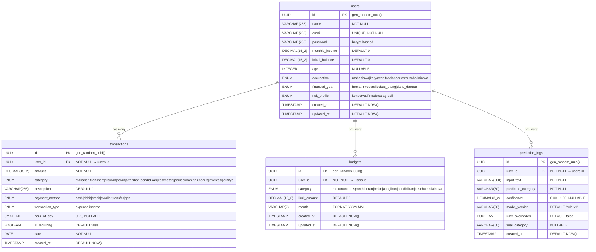

# 🏗️ Arsitektur Sistem FinZ — Draw.io Reference

> **Dokumen ini** berisi semua komponen arsitektur FinZ untuk digambar di draw.io.
> Termasuk: System Architecture, ERD, dan Data Flow.

---

## 1. System Architecture Diagram

### Komponen Utama (Boxes)

```
┌──────────────────────────────────────────────────────────────────────┐
│                        CLIENT LAYER                                  │
│                                                                      │
│  ┌────────────────────────────────┐                                  │
│  │    React Frontend (Vite)       │                                  │
│  │    Port: 5173                  │                                  │
│  │                                │                                  │
│  │  Pages:                        │                                  │
│  │  • Dashboard                   │                                  │
│  │  • Transactions                │                                  │
│  │  • Budget                      │                                  │
│  │  • Profile                     │                                  │
│  │  • Add Transaction             │                                  │
│  │                                │                                  │
│  │  Context:                      │                                  │
│  │  • AuthContext (JWT)           │                                  │
│  │  • FinanceContext (State)      │                                  │
│  └───────────────┬────────────────┘                                  │
│                  │ HTTP/REST (axios)                                  │
│                  │ Authorization: Bearer <JWT>                       │
└──────────────────┼───────────────────────────────────────────────────┘
                   │
                   ▼
┌──────────────────────────────────────────────────────────────────────┐
│                     API GATEWAY LAYER                                │
│                                                                      │
│  ┌────────────────────────────────────────────────────────────────┐  │
│  │              Express.js Backend — Port 8000                    │  │
│  │                                                                │  │
│  │  ┌─────────────────────────────────────────────────────────┐   │  │
│  │  │                 MIDDLEWARE CHAIN                         │   │  │
│  │  │                                                         │   │  │
│  │  │  CORS → Helmet → Compression → BodyParser(1mb)         │   │  │
│  │  │  → RequestLogger(Winston) → RateLimiter(Redis Store)   │   │  │
│  │  │  → AuthMiddleware(JWT) → OwnershipCheck                │   │  │
│  │  └─────────────────────────────────────────────────────────┘   │  │
│  │                                                                │  │
│  │  ┌──────────────────────────────────────────────────────────┐  │  │
│  │  │                    ROUTES                                │  │  │
│  │  │                                                          │  │  │
│  │  │  /api/auth         → authController                     │  │  │
│  │  │  /api/transactions → transactionController              │  │  │
│  │  │  /api/dashboard    → dashboardController                │  │  │
│  │  │  /api/budget-alert → budgetAlertController              │  │  │
│  │  │  /api/budgets      → budgetController                   │  │  │
│  │  │  /api/users        → userController                     │  │  │
│  │  │  /api/admin        → adminController                    │  │  │
│  │  │  /api/predict/*    → aiController                       │  │  │
│  │  │  /api/recommendation → aiController                     │  │  │
│  │  │  /api/financial-score → aiController                    │  │  │
│  │  │  /api/ai/health    → aiController                       │  │  │
│  │  └──────────────────────────────────────────────────────────┘  │  │
│  │                                                                │  │
│  │  ┌──────────────────────────────────────────────────────────┐  │  │
│  │  │                  SERVICES                                │  │  │
│  │  │                                                          │  │  │
│  │  │  transactionService  → CRUD + cache invalidation        │  │  │
│  │  │  dashboardService    → Aggregasi + Redis cache          │  │  │
│  │  │  budgetService       → Budget CRUD                      │  │  │
│  │  │  aiService           → AI orchestration + fallback      │  │  │
│  │  │  aiClient            → HTTP client ke Flask API         │  │  │
│  │  │  cacheService        → Redis get/set/del/pattern        │  │  │
│  │  │  circuitBreaker      → Opossum wrapping                 │  │  │
│  │  └──────────────────────────────────────────────────────────┘  │  │
│  │                                                                │  │
│  │  ┌──────────────────────────────────────────────────────────┐  │  │
│  │  │                  UTILITIES                               │  │  │
│  │  │                                                          │  │  │
│  │  │  textSanitizer  → Clean input sebelum AI inference      │  │  │
│  │  │  logger (Winston) → Structured logging                  │  │  │
│  │  └──────────────────────────────────────────────────────────┘  │  │
│  └────────────────────────────────────────────────────────────────┘  │
└──────────┬────────────────────┬─────────────────────┬────────────────┘
           │                    │                     │
           ▼                    ▼                     ▼
┌─────────────────┐  ┌──────────────────┐  ┌──────────────────────────┐
│  DATA LAYER     │  │  CACHE LAYER     │  │  AI/ML LAYER             │
│                 │  │                  │  │                          │
│  ┌───────────┐  │  │  ┌────────────┐  │  │  ┌────────────────────┐  │
│  │PostgreSQL │  │  │  │   Redis    │  │  │  │ Flask AI Server   │  │
│  │  16+      │  │  │  │  (Valkey)  │  │  │  │ Port: 5000        │  │
│  │Port: 5432 │  │  │  │Port: 6379 │  │  │  │                    │  │
│  │           │  │  │  │            │  │  │  │ Endpoints:         │  │
│  │ Tables:   │  │  │  │ Keys:      │  │  │  │ • /predict/kategori│  │
│  │ • users   │  │  │  │ • rl:auth  │  │  │  │ • /predict/saldo  │  │
│  │ • trans-  │  │  │  │ • rl:api   │  │  │  │ • /predict/batch  │  │
│  │   actions │  │  │  │ • cache:   │  │  │  │ • /alerts/generate│  │
│  │ • budgets │  │  │  │   dashboard│  │  │  │ • /alerts/:id/:m  │  │
│  │ • predic- │  │  │  │   score    │  │  │  │ • /health         │  │
│  │   tion_   │  │  │  │   reco     │  │  │  │                    │  │
│  │   logs    │  │  │  │   alerts   │  │  │  │ Models:            │  │
│  │ • Sequel- │  │  │  │   predict  │  │  │  │ • TF Klasifikasi  │  │
│  │   izeMeta │  │  │  │            │  │  │  │ • TF Prediksi     │  │
│  └───────────┘  │  │  └────────────┘  │  │  │ • TF-IDF Vector   │  │
│                 │  │                  │  │  │ • Rule Engine      │  │
│  UUID v4 PKs    │  │  TTL: 30-600s   │  │  │ • Budget Alert     │  │
│  Sequelize ORM  │  │  Prefix: finz:  │  │  └────────────────────┘  │
│  Migrations     │  │  ioredis client │  │                          │
└─────────────────┘  └──────────────────┘  │  Circuit Breaker:        │
                                           │  • timeout: 10s          │
                                           │  • threshold: 50%        │
                                           │  • reset: 30s            │
                                           └──────────────────────────┘
```

### Koneksi Antar Komponen (Arrows untuk Draw.io)

| From | To | Label | Type |
|------|----|-------|------|
| React Frontend | Express Backend | REST API (axios) + JWT Bearer | → Solid |
| Express Backend | PostgreSQL | Sequelize ORM (TCP 5432) | → Solid |
| Express Backend | Redis | ioredis (TCP 6379) | → Solid |
| Express Backend (aiClient) | Flask AI Server | HTTP (axios, port 5000) | → Dashed |
| circuitBreaker | aiClient | Wraps AI calls | → Dashed |
| cacheService | Redis | get/set/del | → Solid |
| RateLimiter | Redis | RedisStore | → Solid |
| Flask AI Server | TF Models | model_klasifikasi.h5, model_prediksi_saldo.keras | → Solid |
| Flask AI Server | Rule Engine | Fallback classifier | → Dashed |

### Warna Rekomendasi (Draw.io)

| Komponen | Warna Background | Border |
|----------|------------------|--------|
| React Frontend | #61DAFB (React Blue) | #333 |
| Express Backend | #68A063 (Node Green) | #333 |
| PostgreSQL | #336791 (PG Blue) | #fff |
| Redis | #DC382D (Redis Red) | #fff |
| Flask AI Server | #306998 (Python Blue) | #fff |
| Middleware | #F5A623 (Orange) | #333 |
| Services | #7B68EE (Purple) | #333 |
| Circuit Breaker | #FF6B6B (Coral) | #333 |

---

## 2. Data Flow Diagram

### Flow 1: User Login
```
User → [Login Form] → POST /api/auth/login
  → authLimiter (Redis) → authController
  → User.findOne(email) → bcrypt.compare
  → JWT.sign({ id: UUID }) → return { token, user }
```

### Flow 2: Create Transaction
```
User → [Add Transaction Form] → POST /api/transactions
  → apiLimiter (Redis) → authMiddleware (JWT verify)
  → transactionController → transactionService.create()
  → Transaction.create() → cacheService.delPattern(user:*)
  → return { id: UUID, ... }
```

### Flow 3: Dashboard Load
```
User → GET /api/dashboard
  → authMiddleware → dashboardController → dashboardService
  → cacheService.get(dashboard:userId)
    → [HIT] return cached
    → [MISS] → Promise.all([
        User.findByPk (initial_balance),
        Transaction.findAll (period),
        Budget.findAll (month)
      ])
    → compute aggregation → cacheService.set(60s)
  → return { total_spending, total_income, category_breakdown, ... }
```

### Flow 4: AI Category Prediction
```
User → POST /api/predict/category { description }
  → authMiddleware → aiController → aiService.predictCategory
  → textSanitizer.sanitize(description)
  → circuitBreaker.fire(() => aiClient.predictKategori(clean_text))
    → [Circuit CLOSED] → HTTP POST flask:5000/predict/kategori
      → [SUCCESS] return { category, confidence }
      → [FAIL] → fallback rule-based keyword matching
    → [Circuit OPEN] → fallback immediately
  → PredictionLog.create() → return result
```

### Flow 5: Budget Alert
```
User → GET /api/budget-alert/:userId/:month
  → authMiddleware → aiController → aiService.getBudgetAlerts
  → cacheService.get(alerts:userId:month)
    → [HIT] return cached
    → [MISS] → Promise.all([
        Budget.findAll,
        Transaction.findAll (expense),
        Transaction.sum (income)
      ])  ← 3 parallel queries (bukan 6+ sequential)
    → compute standard alerts (% usage)
    → circuitBreaker → aiClient.generateAlerts()
    → merge standard + AI alerts
    → cacheService.set(120s)
  → return { alerts, has_budget_set }
```

---

## 3. ERD (Entity Relationship Diagram)

### Mermaid Format (bisa di-copy ke draw.io atau mermaid.live)



### ERD dalam Format Tabel (untuk Draw.io manual)

#### 📋 Tabel: `users`
| Column | Type | Constraint | Default | Note |
|--------|------|------------|---------|------|
| **id** | `UUID` | PK | `gen_random_uuid()` | |
| name | `VARCHAR(255)` | NOT NULL | - | |
| email | `VARCHAR(255)` | UNIQUE, NOT NULL | - | |
| password | `VARCHAR(255)` | NOT NULL | - | bcrypt |
| monthly_income | `DECIMAL(15,2)` | NOT NULL | `0` | Rupiah |
| initial_balance | `DECIMAL(15,2)` | NOT NULL | `0` | Saldo awal |
| age | `INTEGER` | NULLABLE | - | |
| occupation | `ENUM` | NOT NULL | `'karyawan'` | 5 values |
| financial_goal | `ENUM` | NOT NULL | `'dana_darurat'` | 4 values |
| risk_profile | `ENUM` | NOT NULL | `'konservatif'` | 3 values |
| created_at | `TIMESTAMPTZ` | NOT NULL | `NOW()` | |
| updated_at | `TIMESTAMPTZ` | NOT NULL | `NOW()` | |

#### 📋 Tabel: `transactions`
| Column | Type | Constraint | Default | Note |
|--------|------|------------|---------|------|
| **id** | `UUID` | PK | `gen_random_uuid()` | |
| user_id | `UUID` | FK → users.id, NOT NULL | - | CASCADE |
| amount | `DECIMAL(15,2)` | NOT NULL | - | Rupiah |
| category | `ENUM` | NOT NULL | - | 12 values |
| description | `VARCHAR(255)` | NOT NULL | `''` | |
| payment_method | `ENUM` | NOT NULL | `'cash'` | 6 values |
| transaction_type | `ENUM` | NOT NULL | `'expense'` | expense/income |
| hour_of_day | `SMALLINT` | NULLABLE | - | 0-23 |
| is_recurring | `BOOLEAN` | NOT NULL | `false` | |
| date | `DATE` | NOT NULL | - | YYYY-MM-DD |
| created_at | `TIMESTAMPTZ` | NOT NULL | `NOW()` | |

**Indexes**: user_id, category, date, transaction_type

#### 📋 Tabel: `budgets`
| Column | Type | Constraint | Default | Note |
|--------|------|------------|---------|------|
| **id** | `UUID` | PK | `gen_random_uuid()` | |
| user_id | `UUID` | FK → users.id, NOT NULL | - | CASCADE |
| category | `ENUM` | NOT NULL | - | 8 values |
| limit_amount | `DECIMAL(15,2)` | NOT NULL | `0` | Batas Rp |
| month | `VARCHAR(7)` | NOT NULL | - | YYYY-MM |
| created_at | `TIMESTAMPTZ` | NOT NULL | `NOW()` | |
| updated_at | `TIMESTAMPTZ` | NOT NULL | `NOW()` | |

#### 📋 Tabel: `prediction_logs`
| Column | Type | Constraint | Default | Note |
|--------|------|------------|---------|------|
| **id** | `UUID` | PK | `gen_random_uuid()` | |
| user_id | `UUID` | FK → users.id, NOT NULL | - | CASCADE |
| input_text | `VARCHAR(500)` | NOT NULL | - | User input |
| predicted_category | `VARCHAR(50)` | NOT NULL | - | AI result |
| confidence | `DECIMAL(3,2)` | NULLABLE | - | 0.00-1.00 |
| model_version | `VARCHAR(20)` | NULLABLE | `'rule-v1'` | |
| user_overridden | `BOOLEAN` | NOT NULL | `false` | |
| final_category | `VARCHAR(50)` | NULLABLE | - | After override |
| created_at | `TIMESTAMPTZ` | NOT NULL | `NOW()` | |

**Indexes**: user_id, predicted_category, created_at

---

## 4. Relasi Antar Tabel

```
users (1) ──────< (N) transactions     ON DELETE CASCADE
users (1) ──────< (N) budgets          ON DELETE CASCADE  
users (1) ──────< (N) prediction_logs  ON DELETE CASCADE
```

Semua FK menggunakan `ON UPDATE CASCADE ON DELETE CASCADE`.

---

## 5. Redis Key Map

| Key Pattern | TTL | Description |
|-------------|-----|-------------|
| `finz:rl:auth:{ip}` | 15min | Auth rate limit counter |
| `finz:rl:api:{ip}` | 15min | API rate limit counter |
| `finz:cache:dashboard:{userId}` | 60s | Dashboard aggregation cache |
| `finz:cache:score:{userId}` | 300s | Financial score cache |
| `finz:cache:reco:{userId}` | 600s | AI recommendations cache |
| `finz:cache:alerts:{userId}:{month}` | 120s | Budget alerts cache |
| `finz:cache:prediction:{userId}:{type}` | 300s | AI prediction cache |
| `finz:cache:ai:health` | 30s | AI server health status |

---

## 6. API Endpoint Map

### Express Backend (Port 8000)

| Method | Endpoint | Auth | Controller |
|--------|----------|------|------------|
| POST | `/api/auth/register` | ❌ | authController |
| POST | `/api/auth/login` | ❌ | authController |
| GET | `/api/auth/me` | ✅ JWT | authController |
| GET | `/api/transactions` | ✅ JWT | transactionController |
| POST | `/api/transactions` | ✅ JWT | transactionController |
| PUT | `/api/transactions/:id` | ✅ JWT | transactionController |
| DELETE | `/api/transactions/:id` | ✅ JWT | transactionController |
| GET | `/api/dashboard` | ✅ JWT | dashboardController |
| GET | `/api/users/:id` | ✅ JWT + Owner | userController |
| PUT | `/api/users/:id` | ✅ JWT + Owner | userController |
| GET | `/api/users/:id/budgets` | ✅ JWT | userController |
| POST | `/api/users/:id/budgets` | ✅ JWT | userController |
| DELETE | `/api/users/:id/budgets/:bid` | ✅ JWT | userController |
| POST | `/api/predict/balance` | ✅ JWT | aiController |
| POST | `/api/predict/category` | ✅ JWT | aiController |
| GET | `/api/recommendation/:uid` | ✅ JWT | aiController |
| GET | `/api/financial-score/:uid` | ✅ JWT | aiController |
| GET | `/api/ai/health` | ✅ JWT | aiController |
| POST | `/api/budget-alert/generate` | ✅ JWT | aiController |
| GET | `/api/budget-alert/:uid/:bulan` | ✅ JWT | aiController |
| POST | `/api/budget-alert/:uid/:bulan/read` | ✅ JWT | aiController |
| GET | `/api/budget-alert/:uid/history` | ✅ JWT | aiController |

### Flask AI Server (Port 5000)

| Method | Endpoint | Description |
|--------|----------|-------------|
| GET | `/` | Index info |
| GET | `/health` | Health check + model status |
| POST | `/predict/kategori` | Klasifikasi kategori transaksi |
| POST | `/predict/saldo` | Prediksi saldo akhir bulan |
| POST | `/predict/batch` | Batch: klasifikasi + prediksi |
| POST | `/alerts/generate` | Generate budget alerts |
| GET | `/alerts/:uid/:bulan` | Get alerts per bulan |
| POST | `/alerts/:uid/:bulan/read` | Mark alert as read |
| GET | `/alerts/:uid/history` | Alert history all months |
| GET | `/logs` | Prediction logs |
| GET | `/logs/stats` | Prediction statistics |

---

## 7. Tech Stack Summary (untuk Draw.io Legend)

| Layer | Technology | Version |
|-------|------------|---------|
| Frontend | React + Vite | Vite 8.x |
| UI Icons | Phosphor Icons | 2.x |
| Charts | Recharts | 2.x |
| Backend | Express.js | 4.19 |
| ORM | Sequelize | 6.37 |
| Database | PostgreSQL | 18.3 |
| Cache | Redis (Valkey) | 7.x |
| AI Server | Flask (Python) | 3.x |
| ML Framework | TensorFlow | 2.x |
| Auth | JWT (jsonwebtoken) | 9.x |
| Security | Helmet, HPP | 8.x |
| Logging | Winston | 3.x |
| Circuit Breaker | Opossum | 9.x |
| Rate Limiting | express-rate-limit + Redis Store | 8.x |
