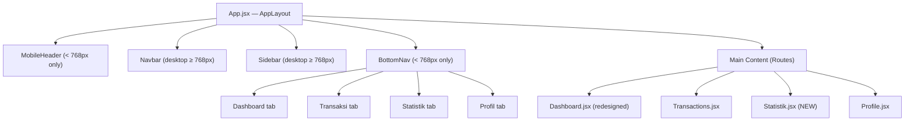

# Mobile-First Native Redesign — FinZ Dashboard

Full redesign of the FinZ financial app from a responsive web layout to a native mobile experience on viewports ≤ 768px, while preserving the existing desktop layout.

## User Review Required

> [!IMPORTANT]
> **Navigation Restructuring**: The current 5 sidebar links (Dashboard, Transaksi, Tambah, Budget, Profil) will be consolidated into 4 bottom nav tabs: **Dashboard, Transaksi, Statistik, Profil**. The "Tambah" action becomes a FAB (Floating Action Button) on the Dashboard, and "Budget" moves into the "Statistik" tab which combines charts + budget views.

> [!WARNING]
> **Breaking Change — Sidebar hidden on mobile**: The hamburger menu + sidebar drawer will be completely hidden on mobile (< 768px). Desktop sidebar remains untouched. Users navigate exclusively via the Bottom Navigation Bar on mobile.

## Open Questions

1. **Statistik Tab Content**: Should "Statistik" contain only the existing charts (Spending Pie, Monthly Bar, Daily Line) or also include the Budget management page? I propose combining both since they are both analytical views.
2. **Transaction "Add" Flow**: Should tapping the FAB on Dashboard navigate to `/add`, or open a bottom-sheet modal for quick entry? Current plan: navigate to `/add` page.

---

## Proposed Changes

### Component Architecture Overview



---

### Bottom Navigation Component

#### [NEW] [BottomNav.jsx](file:///home/masbay/PROJECT/FinZ/src/components/BottomNav.jsx)

- Fixed bottom bar, visible only on mobile (< 768px)
- 4 tabs with Phosphor icons: `House` (Dashboard), `Receipt` (Transaksi), `ChartPieSlice` (Statistik), `UserCircle` (Profil)
- Active tab has emerald accent color + subtle scale animation
- Each tab: min touch target 44×48px
- Frosted glass background matching the deep navy palette
- Tab switch triggers a fade transition on page content
- Includes an active tab indicator (animated underline/pill)

---

### Mobile Header Component

#### [NEW] [MobileHeader.jsx](file:///home/masbay/PROJECT/FinZ/src/components/MobileHeader.jsx)

- Compact header: 32px profile avatar (initials) + "Selamat Pagi, Bayu" text
- Right side: NotificationBell icon only (search hidden on mobile)
- Sticky top, frosted glass background
- Only visible on mobile (< 768px); desktop still uses existing `Navbar.jsx`

---

### Dashboard Page Redesign

#### [MODIFY] [Dashboard.jsx](file:///home/masbay/PROJECT/FinZ/src/pages/Dashboard.jsx)

**Key changes for mobile viewport:**

1. **Header Section**: Remove breadcrumb + "Dashboard Overview" title. The MobileHeader already provides context.
2. **Stat Cards → Horizontal Scroll Deck**:
   - Wrap the 3 stat cards (Saldo, Pemasukan, Pengeluaran) in a horizontal scroll container with CSS `overflow-x: auto; scroll-snap-type: x mandatory`
   - Each card sized ~280px wide with `scroll-snap-align: start`
   - The "Prediksi Sisa" becomes a compact summary line below the scroll deck (not a full card)
3. **Transaction List → Tappable List-Tiles**:
   - Remove table header entirely on mobile
   - Each transaction = a list-tile with: category icon (28px, rounded), description+category left, amount right
   - Payment method shown as small tag below description
   - Date shown as subtle secondary text
   - Active state (`:active` pseudo-class) with subtle background highlight for tap feedback
   - All items are `min-height: 56px` for thumb accessibility
4. **Financial Health Score + Charts**: Move to Statistik page (hidden from mobile Dashboard)
5. **FAB**: Add a floating action button "+" bottom-right (above BottomNav) linking to `/add`

---

### New Statistik Page

#### [NEW] [Statistik.jsx](file:///home/masbay/PROJECT/FinZ/src/pages/Statistik.jsx)

- Contains: Financial Health Score ring, Spending Pie Chart, Monthly Bar Chart, Daily Line Chart
- Mobile-optimized chart sizing
- Links to Budget page or embeds budget summary
- Uses existing chart components with adjusted sizing

---

### App Layout Changes

#### [MODIFY] [App.jsx](file:///home/masbay/PROJECT/FinZ/src/App.jsx)

- Import `BottomNav` and `MobileHeader`
- Add `<MobileHeader />` (shown only on mobile via CSS)
- Add `<BottomNav />` (shown only on mobile via CSS)
- Hide `<Sidebar />` on mobile via CSS (not JS — no unnecessary re-renders)
- Hide desktop `<Navbar />` on mobile via CSS
- Add route for `/statistik` → `<Statistik />`
- Add bottom padding to `<main>` to account for BottomNav height (~72px)
- Remove the `<footer>` on mobile

---

### CSS Changes

#### [MODIFY] [index.css](file:///home/masbay/PROJECT/FinZ/src/index.css)

**New CSS blocks to add:**

| Section | Details |
|---------|---------|
| **Bottom Nav** | `.bottom-nav` — fixed bottom, frosted glass, flex row, z-50 |
| **Mobile Header** | `.mobile-header` — compact sticky header |
| **Horizontal Scroll** | `.scroll-deck` — `overflow-x: auto; scroll-snap-type: x mandatory; -webkit-overflow-scrolling: touch` |
| **Scroll Card** | `.scroll-card` — `scroll-snap-align: start; min-width: 280px` |
| **List Tile** | `.list-tile` — flexbox, min-height 56px, tap feedback with `:active` |
| **FAB** | `.fab` — floating 56px circle, emerald gradient, glow shadow, positioned above bottom nav |
| **Tab Transitions** | `.tab-content-enter/exit` — fade/slide animations for page transitions |
| **Mobile Typography** | Updated scale: body 14px, stat-value 20px on scroll cards, labels 10px |
| **Touch Targets** | All interactive elements get `min-height: 44px; min-width: 44px` on mobile |
| **Hide Desktop** | `.desktop-only` hidden below 768px, `.mobile-only` hidden above 768px |
| **Bottom Padding** | `.main-content` gets `padding-bottom: 88px` on mobile for BottomNav clearance |

**Mobile typography scale (< 640px):**
```
Greeting text: 13px, weight 400
User name: 16px, weight 600
Stat label: 10px, uppercase, letter-spacing 1.5px
Stat value: 20px, weight 700
List tile primary: 14px, weight 500
List tile secondary: 12px, weight 400
Amount: 15px, weight 700 (mono-like)
```

---

### Existing Components — No Changes Needed

| File | Reason |
|------|--------|
| [Sidebar.jsx](file:///home/masbay/PROJECT/FinZ/src/components/Sidebar.jsx) | Hidden on mobile via CSS; desktop unchanged |
| [Navbar.jsx](file:///home/masbay/PROJECT/FinZ/src/components/Navbar.jsx) | Hidden on mobile via CSS; desktop unchanged |
| [Card.jsx](file:///home/masbay/PROJECT/FinZ/src/components/Card.jsx) | Reused as-is in Statistik page |
| [NotificationBell.jsx](file:///home/masbay/PROJECT/FinZ/src/components/NotificationBell.jsx) | Reused in MobileHeader |
| Chart components | Reused in Statistik page |
| [FinanceContext.jsx](file:///home/masbay/PROJECT/FinZ/src/context/FinanceContext.jsx) | No data model changes |
| Auth-related files | Untouched |

---

## Design System Alignment

Based on the UI/UX Pro Max skill recommendations:

| Property | Value |
|----------|-------|
| **Style** | Dark Mode (OLED) — WCAG AAA |
| **Colors** | Primary `#0F172A`, Secondary `#1E293B`, CTA `#22C55E`, BG `#020617`, Text `#F8FAFC` |
| **Typography** | IBM Plex Sans (kept as Inter for consistency with existing) |
| **Icons** | Phosphor Icons (existing — no emoji icons) |
| **Touch Targets** | Min 44×44px, 8px gap between targets |
| **Transitions** | 150–300ms, cubic-bezier(0.4, 0, 0.2, 1) |
| **Key Effects** | Minimal glow, frosted glass, high readability |

---

## Verification Plan

### Automated Tests
```bash
npm run build   # Ensure no compilation errors
npm run dev      # Visual verification in browser
```

### Browser Testing
- Open the app in browser at 375px width (iPhone SE)
- Verify Bottom Navigation renders with 4 tabs
- Verify horizontal scroll deck for stat cards
- Verify tappable transaction list-tiles
- Verify FAB positioning above BottomNav
- Verify Statistik page renders charts
- Switch to 1024px width — verify desktop layout is unchanged
- Test tab switching animations
- Verify all touch targets ≥ 44px

### Manual Verification
- Record browser session showing the mobile redesign
- Screenshot comparison: before vs after at 375px
